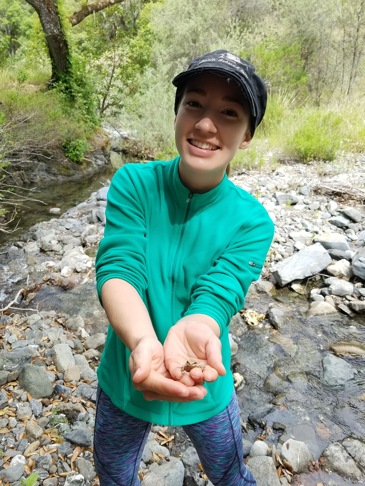
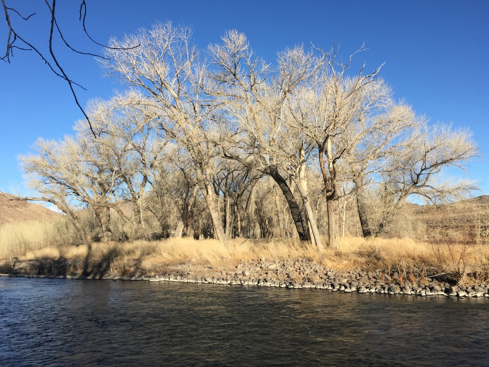
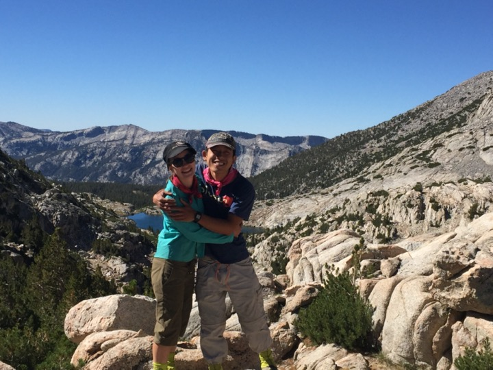

## About me

I am a PhD candidate in the Water Management Lab at UC Davis, where my research in hydrology focuses on streamflow analysis and ecological response to changes in flowing water environments. I started my career in water resources at the California State Water Resources Control Board, where I developed water quality policy to protect urban waterways from pesticide runoff. I recently transplanted to Reno, NV, where I am planning my next chapter of research on the Lower Truckee River and its riparian ecology. In my free time I enjoy exploring my Sierras backyard with my husband Leo - on bike, foot, skis, or climbing ropes! 

## Research

### Environmental flow management and the Functional Flows Calculator
Environmental flows refer to an allocation of water from a river that is meant to stay in the river, for the protection of aquatic ecosystems. This is in contrast to water allocations for human needs, such as water for agriculture, cities, or industry. By setting environmental flows, we seek to answer a central question: how much water does a river need, in order to protect aquatic ecosystems? In this research, I helped answer this big question of "how much water" through creation of a software tool that analyzes daily streamflow data through the lens of functional flows, a paradigm of water management that focuses on key aspects of the annual flow regime known to serve ecological functions. Through a combination of signal processing methods grounded in hydro-ecological science, the tool my team and I developed calculates ecologically-relevant flow metrics that can be used to design environmental flow regimes. This project can be explored in-depth at eFlows.ucdavis.edu, where users can explore and visualize the natural hydrology of streams in California. 

### Streamflow patterns in a changing climate
As climate change affects temperature and precipitation patterns globally, natural patterns in the magnitude and timing of streamflow are also affected. In the western US, aquatic species have adapted over millenia to patterns of extreme seasonal highs and lows, resulting from dry summers and wet winters. In California, we have already begun to see historic patterns of streamflow begin to shift. In mountainous areas such as the Sierra Nevada, warming temperatures are causing precipitation to fall more as rain instead of snow, which changes streamflow by reducing the seasonal snowmelt pulse. Precipitation events are also becoming less frequent but more severe in some areas, which increases the flashiness of streamflow. These changes in streamflow have serious consequences from both a water management perspective, for water supply and flood control, as well as ecological implications. In this project, I use the functional flows calculator developed in my previous research to quantify changes to seasonal streamflow patterns across the diversity of streams found in California. I use this approach both to search for patterns of change across the past century, and to asses potential future changes through analysis of modeled streamflow extending to 2100.  

### Cottonwood-streamflow interactions on the Lower Truckee River, Nevada

I plan to study cottonwood trees along the banks of the Lower Truckee River in Nevada, and how past and current water management practices have affected their growth and survival. Understanding these trees is important because cottonwoods support the entire Lower Truckee River environment by stabilizing banks and providing wildlife habitat. Like most major rivers in the western United States, the Truckee River is a highly contested water resource that must balance competing interests from municipal, agricultural, and environmental water users. As a result of these multiple needs, the ecosystem of the Lower Truckee River has been highly altered over the past century, including removal of water from the river for irrigation and straightening of sections of channel for flood control. This alteration has significant consequences because the cottonwood trees of the Lower Truckee River require a continual source of water for survival. No one has yet determined the status of mature cottonwood trees along the river, and how decades of river management have affected their growth and survival. Using a combination of field methods, spatial analysis, and streamflow analysis with the functional flows calculator, I hope to prove that flow management on the river has a direct effect on the health of cottonwoods, to help point the way towards improved flow management to support cottonwoods and their river ecosystem.

##  Publications and products

*Patterson, N. K.*, Lane, B. A., Sandoval-Solis, S., Pasternack, G. B., Yarnell, S. M., and Qiu, Y. A Hydrologic feature detection algorithm to quantify seasonal components of flow regimes. 2020. Journal of Hydrology, 585, 1–12. [DOI: 10.1016/j.jhydrol.2020.124787](https://doi.org/10.1016/j.jhydrol.2020.124787)

Dahlke, H., LaHue, G., Mautner, M., Murphy, N., *Patterson, N.*, Waterhouse, H., Yang, F., Foglia, L. Managed Aquifer Recharge as a Tool to Enhance Sustainable Groundwater Management in California: Examples from Field and Modeling Studies. 2018. In Advanced Tools for Integrated Water Resources Management, Volume 3 1st Edition. Elsevier Academic Press. [DOI: 10.1016/bs.apmp.2018.07.003](https://doi.org/10.1016/bs.apmp.2018.07.003)

[eFlows website](https://eflows.ucdavis.edu/)  
Website featuring visualization and analysis tools to explore California's natural hydrology, hosting a webtool version of the functional flows calculator for streamfloe analsis. I contributed to the conceptualization of the website and the data and code supporting the website's features. 

## Curriculum Vitae

[View my CV here.](./content/blog/about/CV_2020.pdf) 

> "Do a huge volume of work. Put yourself on a deadline so that every week or every month you know you're going to finish one story. It is only by going through a volume of work that you're going to catch up and close that gap. And the work you're making will be as good as your ambitions." - Ira Glass

## Outdoor Adventures
When not working on my research, I try to continue learning and developing myself through engaging in challenging, formative outdoor pursuits. I have always loved the idea of adventure, and seeking it wherever possible. My first forays into to outdoors began in the summer after my first year in college, when I took a summer job roomskeeping in Yosemite National Park. I decided I would take whatever job necessary to allow me to live in an oustanding natural setting, though I never would have expected the impact this summer in Yosemite had on the rest of my life. It was here I learned how to backpack in the wilderness, rock climb, and enjoy the outdoors independently. I hiked every possible trail I could access from my home in Yosemite Valley, and the next summer I returned to do it again. The ardent love for the outdoors I fostered in Yosemite influenced the direction of my studies and career in water resources, and inspired many other outdoor adventures to follow. Below are a few of my favorites!  

### John Muir Trail

My husband Leo and I hiked the John Muir Trail for our honeymoon in 2016. After the hectic experience of planning a wedding, it was a great escape to hike and camp in outstanding scenery for three weeks! 

### Northwest Bike Tour
Before starting grad school, I took an extended bike tour of the northwest, starting from Seattle and travelling east to Glacier National Park, and then back west to Portland. The journey of 1400 miles took three weeks, and gave me the opportunity to meet many interesting people and experience both urban and rural parts of the country from up-close. 

### Evolution Traverse

The Evolution Traverse is an 8-mile ridgeline climb in the high sierras, topping nine 13,000 ft  peaks in the Evolution Range including Mt. Darwin at 13,831 ft. Portions of the climb are technical and steep, reaching up to 5.9 grade climbing, while many sections consist of 3rd - 4th class scrambling over loose rock. Leo and I climbed this route in 2017 for our 1st wedding anniversary, after being inspired by views of the Evolution Range on our honeymoon the year before. The route took us 3 days, with a day of approach on either side for a five day adventure. This remains on of our wildest and most remote climbing adventures yet! 

### Minaret Traverse 
<!--  -->
Leo and I took on the Minaret Traverse for our third wedding anniversary, solidly setting our habit of doing long risky climbs for our wedding anniversaries. The Minaret Traverse is a remote, seldom-climbed route along a ridgeline of jagged metamorphic peaks in the high sierra near Mammoth Mountain. This climb took us three days to complete, with two nights bivied in ridgetop alcoves along the crest of the peaks. The rock was sharp, loose, and scary, and I remember this as the wildest anniversary I've survived to date! 

## Contact
- nkpatterson@ucdavis.edu
- [Researchgate profile](https://www.researchgate.net/profile/Noelle_Patterson)
- [Linkedin](https://www.linkedin.com/in/noelle-patterson/)
- [Github](https://github.com/NoellePatterson)

