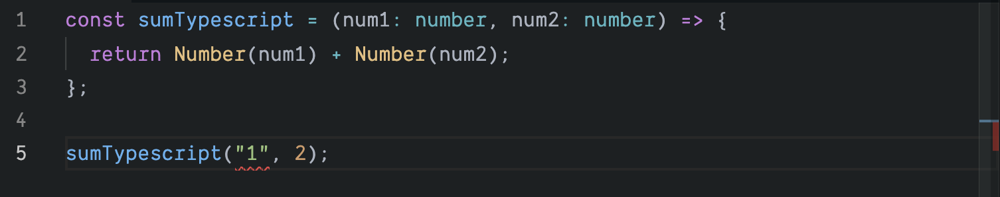

It has been about two years since I started using Typescript instead of Javascript in web development especially in React. Coming directly with JS prior to us, I have always found the process of simply debugging difficult (I type something first, wait for webpack dev server to refresh, and finally receive the error message). I started trying Typescript mostly because I need a tool that has basic type support to speed up the development process.

In this post, I will walk through a simple React project built with Typescript which will include the following topics:

- Discuss on some of the basics on Typescript
- How to start a React project using Typescript
- Discuss whether to eject from CRA-TS or not
- How to declare prop types for React components
- How to use third party libraries

## 1. Typescript 101

One of the key benefits of Typescript to me is type annotation. Initially, coming straight from JS, using type annotation was rather a struggle. The syntax was unfamiliar and time consuming to write. It took me about one month of using it to start to appreciate its power and why many developers much prefer a [statically typed languages](https://en.wikipedia.org/wiki/Type_system).

Here I will create a simple example on how to convert a Javascript function to Typescript while explaining the benefits of type annotation.

We can start with a super simple `sum` function. A function takes two numbers and returns the sum.

```js
const sum = (num1, num2) => {
  return num1 + num2
}
```

To run this function, we can do `sum(1, 2)` which will output `3`. But what if we put in `sum("1",2)`? The code will output `"12"`(notice it is a string) without an error message. Down the line where we are expecting `3`, we will see a silent `"12"` being used.

Once I finally trace down the error, we could rewrite the function again.

```js
const sum = (num1, num2) => {
  return Number(num1) + Number(num2)
}
```

But what if we try to run `sum("abc", 2)`. As we see, it would be ideal to force both `num1` and `num2` to be a number. Warn us the potential error if we submit without a number. This is where Typescript comes in.

```ts
const sumTypescript = (num1: number, num2: number) => {
  return num1 + num2
}
```

Notice the `: number` we added at each of the arguments. This is simply saying, `num1` and `num2` both have to be a number.

At this point, if we would try `sumTypescript("1", 2)`, and run the program with `tsc file.ts`. You will see the error pops up, and this error will not get propagated down unknowingly.

> Argument of type '"1"' is not assignable to parameter of type 'number'

Even better, if you are using an editor like VSCode, you will see the red warning line under.



There are many benefits of using Typescript, you can read the documentation [here](https://www.typescriptlang.org/docs/home.html) or go through [Tutorials Point](https://www.tutorialspoint.com/typescript/index.htm).

## 2. Build

I moved `App.js` file to a different folder, it seems like that is not allowed. It needs to be `export default` and it has to be located in the root folder.

## 3. With Router
